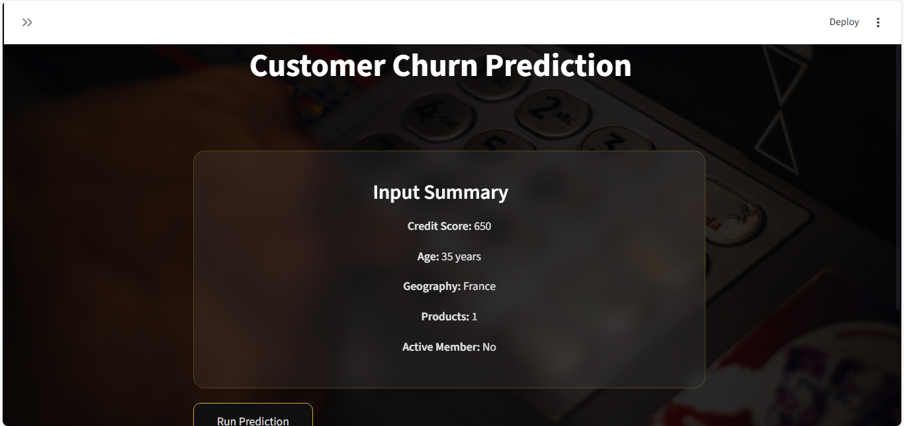
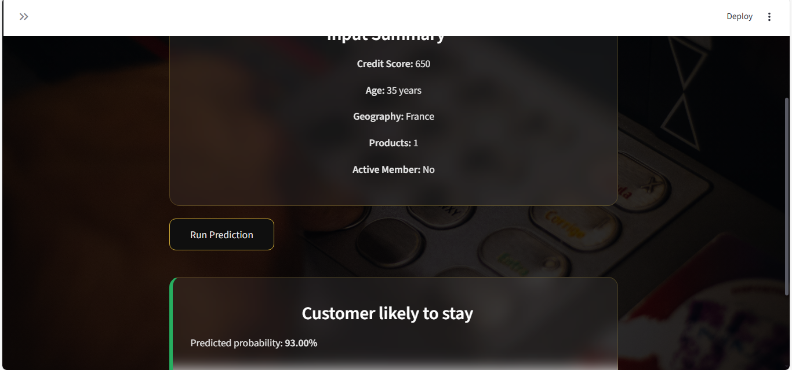
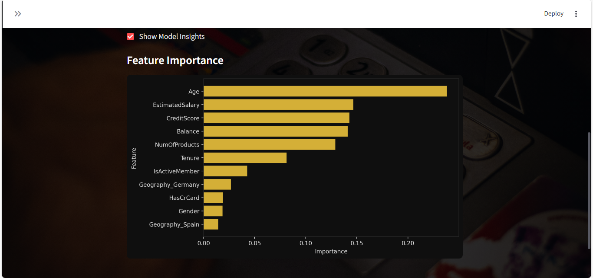
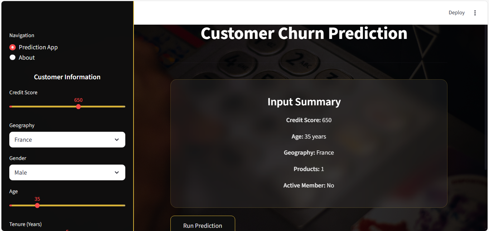

# Customer Churn Prediction App

## Overview
This is a **Streamlit web application** for predicting customer churn.  
It uses a **Random Forest Classifier** trained on customer data to predict whether a customer is likely to leave the bank.  

---

## Features
- Interactive sidebar to input customer information
- Real-time prediction with probability
- Input summary card
- Feature importance visualization
- Clean and professional UI with banking-themed background

---

## Demo
You can try the live app here:  
[Streamlit App Link](https://share.streamlit.io/<your-username>/<repo-name>/main/app.py)

---

## Screenshots

**Screenshot 1** – Main Dashboard  

**Screenshot 2** – Input Summary  

**Screenshot 3** – Run Prediction Button  

**Screenshot 4** – Prediction Result (Customer likely to stay)  

**Screenshot 6** – Feature Importance (Bar Chart)  

**Screenshot 7** – Sidebar Input Example  

**Screenshot 8** – Full Application View  

---

## Project Structure
